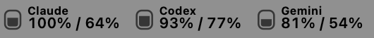
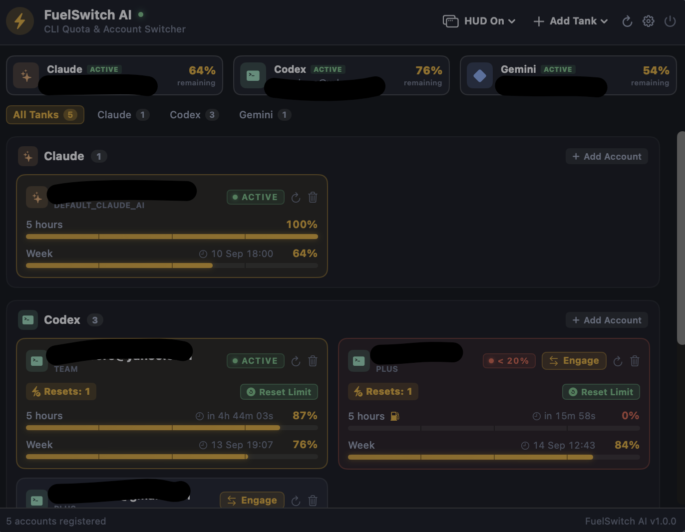
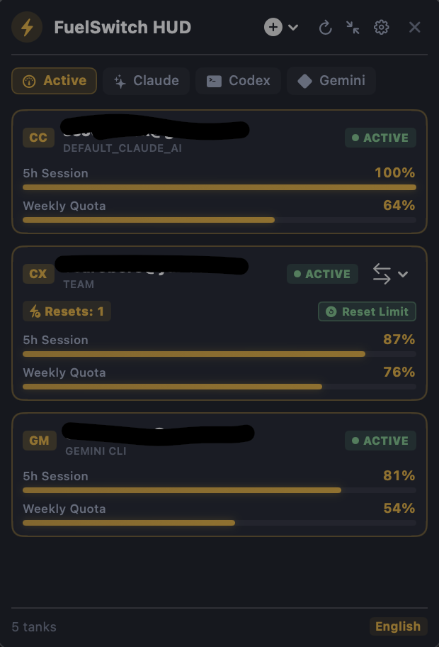

# FuelSwitch AI - Codex, Gemini, Claude Usage Widget + Switcher Account

macOS menu bar app and floating HUD that monitors Claude Code, Codex, and Gemini CLI usage limits, with 1-click account switching.

[](https://github.com/tomaszboloz/FuelSwitch-AI/actions)
[](LICENSE)
[](https://apple.com)

[Features](#features) • [Installation](#installation) • [Architecture](#architecture) • [Security](#security) • [Contributing](#contributing)

---

## Overview

FuelSwitch AI is a macOS menu bar app and floating desktop HUD for engineers running multiple accounts on **Claude Code**, **Codex**, and **Gemini CLI**. It tracks 5-hour and weekly quota windows per account, shows a live reset countdown for each, and lets you switch the active credentials for a CLI without leaving your terminal.

Created by [Tomasz Bołoz](https://www.damtox.pl). Inspired by Headroom AI.

## Features

- **1-click CLI switching** — swap active credentials for Claude Code (`~/.claude.json` + Keychain), Codex (`~/.codex/auth.json`), and Gemini CLI without restarting anything.
- **Threshold notifications** — a native macOS notification at 75/90/95% usage (configurable), for each account and window, before you hit the wall — not after.
- **Auto-switch on quota hit** — when the active account runs dry, automatically switch to the best-available same-provider account, with a cooldown against flapping. Opt-in, off by default.
- **Pace projection** — a glyph next to each account's usage showing whether it's ahead of, on, or burning faster than its quota window's pace.
- **Menu bar icon styles** — gauge, battery, percent-only, or monochrome.
- **Per-profile launcher** — a generated shell snippet (`fs-work`, `fs-personal`, …) that switches the active CLI account straight from the terminal via a `fuelswitch://` URL, no need to open the app.
- **Claude Code statusline integration** — installs a generated script as your Claude Code `statusLine`, showing Claude, Codex, and Gemini usage together in one line inside every Claude Code session.
- **Adaptive refresh** — shortens the poll interval automatically after recent CLI activity, layered on top of your manually chosen interval.
- **Floating HUD** — a draggable, always-on-top panel with the same live data as the main window, in expanded or compact layout.
- **Reset countdowns** — every quota window shows exactly when it resets, not just the current percentage.
- **Local-only** — account tokens live in `~/Library/Application Support/FuelSwitch/accounts.json` (`0600` permissions). No servers, no analytics, no telemetry.
- **Every feature above has its own off switch** in Settings — nothing new ships as forced-on.

## Installation

### Requirements

- macOS 13 or later, Apple Silicon or Intel.
- Xcode 16 / Swift 6 toolchain to build from source.

### Build from source

```bash
git clone https://github.com/tomaszboloz/FuelSwitch-AI.git
cd FuelSwitch-AI
swift test
make app        # builds .build/FuelSwitch AI.app (ad-hoc signed, this machine only)
make run
```

### Prebuilt release

Download `FuelSwitch-AI.dmg` from the [Releases](https://github.com/tomaszboloz/FuelSwitch-AI/releases) page and verify it against the matching `.sha256` file.

This build is not notarized by Apple (no Apple Developer Program membership behind it), so first launch shows *"Apple could not verify that FuelSwitch AI is free of malware"*. To open it anyway:

- Right-click (Control-click) the app → **Open** → **Open**, once, or
- In Terminal: `xattr -cr "/Applications/FuelSwitch AI.app"`

The `Makefile` has a full `make release` target (sign, notarize, staple, package) for anyone building with their own Developer ID certificate and notarytool credentials.

## CLI account switching

| CLI | Config file | Keychain |
| --- | --- | --- |
| Claude Code | `~/.claude.json` | `Claude Code-credentials` |
| Codex | `~/.codex/auth.json` | — (file-based) |
| Gemini CLI | provider-managed OAuth token | — (file-based) |

Click an account in the menu bar panel or the HUD, then **Engage** — the CLI picks up the new credentials on its next call.

## Screenshots

### Menu Bar Status Item


### Main Application Panel


### Floating Desktop HUD — Expanded


### Floating Desktop HUD — Compact


## Architecture

```
FuelSwitchCore   domain logic: Account/LimitWindow/AccountUsage models,
                 usage polling, OAuth/PKCE flows, CLISwitcher, AccountStore
FuelSwitch       SwiftUI menu bar UI, settings, and the AppKit floating HUD
```

`FuelSwitchCore` has no UI dependencies and is covered by its own test target.

## Security

- Account tokens live only on disk at `~/Library/Application Support/FuelSwitch/accounts.json`, `0600` permissions.
- Token values are redacted from any `CustomStringConvertible` description.
- OAuth exchanges use PKCE (32-byte verifier) and a validated `state` parameter via `SecRandomCopyBytes`.
- No bundled Gemini OAuth client — Google doesn't allow redistributing installed-app secrets. Set `FUELSWITCH_GEMINI_CLIENT_ID` / `FUELSWITCH_GEMINI_CLIENT_SECRET` at build time with your own Google Cloud OAuth client to enable Gemini sign-in.

## Testing

```bash
swift test --parallel
```

## Contributing

See [CONTRIBUTING.md](CONTRIBUTING.md) and [CODE_OF_CONDUCT.md](CODE_OF_CONDUCT.md).

## License

MIT — see [LICENSE](LICENSE). Copyright © 2026 [Tomasz Bołoz](https://www.damtox.pl).
